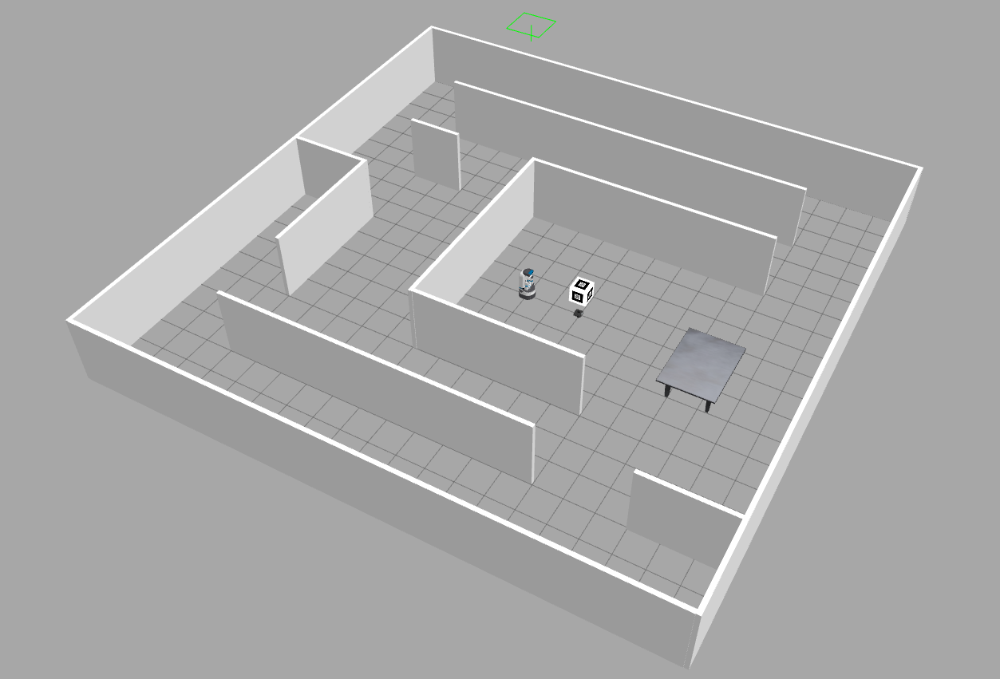
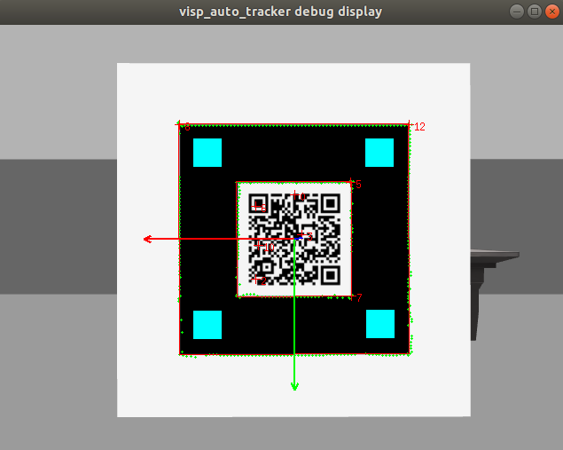

Sensors & Control Group Project 
======

Welcome to our group project for Sensors and Control Autumn 2022.

Viewing Doxygen
------
The Doxygen details an overview of the whole program and can be accessed by

Setup guide
------

The following is a complete guide to setup and run the simulation. Please ensure you have ROS Melodic on Ubuntu 18.04 before you continue. 

1. Install Gazebo (with Fetch) using `sudo apt-get update` and `sudo apt-get install ros-$ROS_DISTRO-fetch-gazebo-demo`.

2. Install Turtlebot packages from entering the lines below in your terminal. 

`cd ~/catkin_ws/src/`  
`git clone https://github.com/ROBOTIS-GIT/turtlebot3_msgs.git`  
`git clone https://github.com/ROBOTIS-GIT/turtlebot3.git`  
`git clone https://github.com/ROBOTIS-GIT/turtlebot3_simulations.git`  
`cd ~/catkin_ws`  
`catkin_make`  

3. Pull all files from the github into your catkin workspace.  

4. Copy the two model files used from the "models" folder and paste them into your ".gazebo" folder from the two lines. This step is only to have the environment models in the simulation and is not necessary.
  
  `cp -r catkin_ws/src/models/maze .gazebo/models/`  
  `cp -r catkin_ws/src/models/table_marble .gazebo/models/`

5. Edit your bashrc file using `gedit ~/.bashrc` in the terminal and insert the following lines of code at the bottom. 

`export TURTLEBOT3_MODEL=waffle`  
`export ROS_MASTER_URI=http://localhost:11311`  
`export ROS_HOSTNAME=localhost`  

6. Run `source ~/.bashrc` in your terminal then build your catkin workspace using `catkin_make`.

7. Run the following four lines of code in your terminal. 

* `roslaunch fetch_gazebo fetch.launch` opens the Gazebo simulation along with Fetch robot, Turtlebot guider robot and pre-made world file.

* `roslaunch visp_auto_tracker tracklive_usb.launch` opens the Fetch's RGB camera and Vision ViSP ROS package to track and obtain the pose from QR code.

* `rosrun controller controller_node` runs the ROS node which initiates the path following algorithm for the Fetch robot.

* `roslaunch turtlebot3_teleop turtlebot3_teleop_key.launch` initiates keyboard controls for the Turtlebot guider robot.
